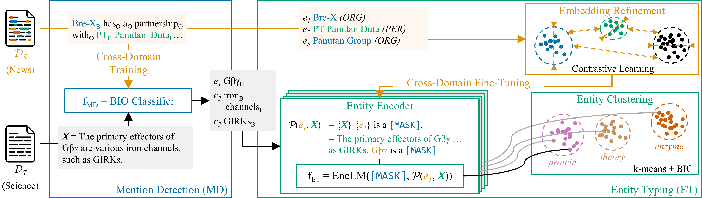

# OWNER — Towards Unsupervised Open-World Named Entity Recognition

## Introduction



Unsupervised and zero-shot Named Entity Recognition (NER) aims to extract and classify entities in documents from a target domain without annotated data.
This setting is particularly relevant for specific domains (biomedical, legal, scientific, ...) where labeled documents are scarce and expensive to create.
While zero-shot NER approaches yield impressive outcomes, they operate under the assumption that all entity types are predefined and known.
This limitation makes their application impossible in novelty detection, exploration, or knowledge graph construction scenarios.

To address this shortcoming, we introduce **OWNER**, our unsupervised and open-world NER model, which does not need annotations in the target domain (similar to zero-shot) and does not require knowledge of the target entity types or their number.
We propose a novel triangular architecture to type and structure entities automatically.
It comprises a prompt-based entity type encoder, an unsupervised clustering model, and embedding refinement with contrastive learning to refine entity embeddings and elicit entity types more precisely.

Results on 13 domain-specific datasets show that OWNER outperforms open-world large language model prompting (14-18% in AMI) and performs competitively with state-of-the-art zero-shot models.
Qualitative analysis shows that OWNER effectively groups entities into semantically meaningful clusters that closely resemble actual entity types (without knowing them beforehand).
The source code of OWNER is publicly available.

## Installation

Please install Anaconda or Miniconda. Then, run:

```shell
conda env create -f ./env.yml
conda activate owner
```

## Data Preparation

OWNER works with datasets formatted in the OWNER format.
For more details, please read the [data/README.md](data/README.md) file.

We provide preprocessing scripts to convert widespread NER formats (e.g., CoNLL) into OWNER format: `conll2003, crossner, fabner, genia, gum, i2b2, mit, pilener, wnut17`.

You first need to download the datasets (we cannot provide them to conform to their respective licenses), and execute the following scripts:

```shell
python -m owner.prepare_data --config-file=[path_to_config.toml]
```

with

- `[path_to_config.toml]`: absolute or relative path to the preprocessing toml config file. We give example configs in the `configs/data/` folder.

## Setup MLflow

OWNER uses MLflow to manage and log the experiments.
See [https://mlflow.org/docs/latest/index.html](https://mlflow.org/docs/latest/index.html) for further details.
If you already use MLflow you can skip this part.

Before running OWNER experiments, you need to launch a MLflow server, by running at the root of the repository:

```shell
conda activate owner
mlflow server --port 5000
```

A Web-UI is available at [http://localhost:5000](http://localhost:5000).
Metrics will be logged in the `mlruns` folder, and artifacts (files) in the `mlartifacts` folder.

In the terminal where you will run OWNER's experiments, please run the following command:

```shell
export MLFLOW_TRACKING_URI=http://localhost:5000
```

It indicates the url of the current running MLflow server.
Execute this command each time you reopen the terminal.

## Running OWNER

Before running OWNER experiments, please ensure that:

1. your MLflow server is running;
2. the `MLFLOW_TRACKING_URI` environment variable is correctly setup in your current terminal;
3. you have activated the `owner` conda environment.

<br/>

To run OWNER, execute the following command, at the root of the repository:

```
mlflow run -e ner -P config_file=[path_to_config.toml] .
```

with

- `[path_to_config.toml]`: absolute or relative path to the OWNER toml config file, e.g., `configs/example.toml`. Do not forget to adjust the paths to the datasets.

We provide a few examples runs in the next section, and explain how to reproduce OWNER results in the next section. Finally, OWNER's predictions are saved in OWNER format as MLflow artifacts, and are accessible using the MLflow GUI or Python client.

### Examples

OWNER trained on CoNLL'03, tested on AI:

```shell
mlflow run -e ner -P config_file=configs/conll2003-ai.toml .
```

OWNER (trained before on CoNLL'03), tested on music:

```shell
mlflow run -e ner -P config_file=configs/conll2003-music.toml .
```

OWNER trained on Pile-NER, tested on AI:

```shell
mlflow run -e ner -P config_file=configs/pilener-science.toml .
```

OWNER (trained before on Pile-NER), tested on i2b2:

```shell
mlflow run -e ner -P config_file=configs/pilener-i2b2.toml .
```

### Reproducing OWNER results

To reproduce all OWNER results, please run the following command, at the root of the OWNER repository:

```shell
conda activate owner
python3 configs/reproducibility/runner.py --template="configs/reproducibility/template.toml" --runs="configs/reproducibility/runs.csv"
```

## License

OWNER's source code is licensed under the GPLv3 License.
For more details, please read the [LICENSE.md](LICENSE.md) file.

```
OWNER
Copyright (C) 2023-2024 Alteca.

This program is free software: you can redistribute it and/or modify
it under the terms of the GNU General Public License as published by
the Free Software Foundation, either version 3 of the License, or
(at your option) any later version.

This program is distributed in the hope that it will be useful,
but WITHOUT ANY WARRANTY; without even the implied warranty of
MERCHANTABILITY or FITNESS FOR A PARTICULAR PURPOSE. See the
GNU General Public License for more details.

You should have received a copy of the GNU General Public License
along with this program. If not, see <https://www.gnu.org/licenses/>.
```